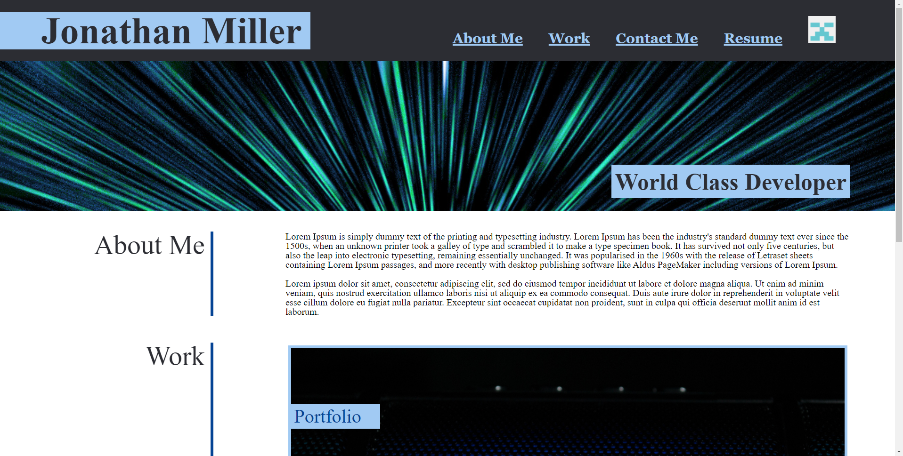

# blue-blah

## Website Link
https://jdmill.github.io/blue-blah/

## Project Description

1. Added NavBar with github avatar and working links
2. Added a hero Image
3. Created a work section - currently most are place holders, but have working links
4. Formatted work section so that the background image areas correspond to the mock up
5. Made the Site responsive
6. Created a contact section on the bottom of the page.

This portfolio webpage was created for the second homework assignment for the web development bookcamp. I struggled to get the elements exactly right, but managed to get pretty close. With more time I may have been able to achieve a better result. Although with the lessons I learned from this exercise it might be better to just start from scratch.

## Mock Up

